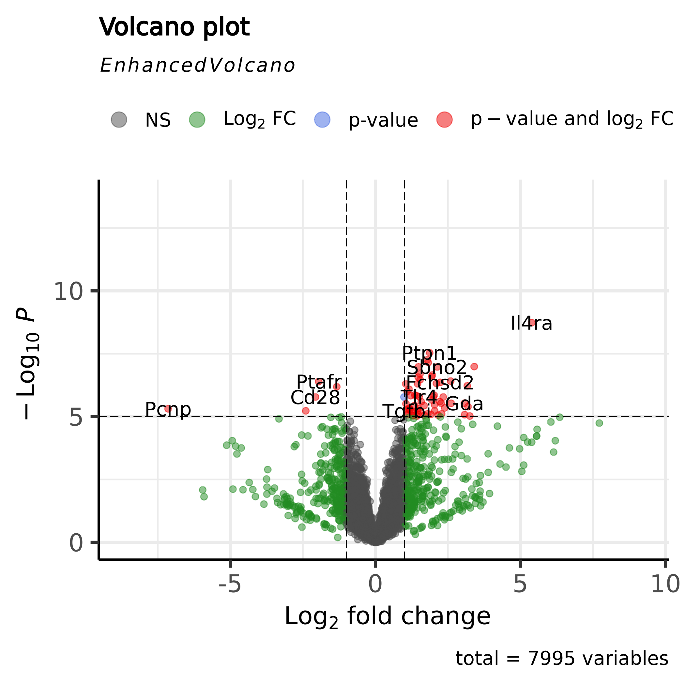

# BIOF 501 Term Project: RNASeq workflow for differential expression and pathway enrichment 

## Table of Contents:
- [Background and Rationale](#background-and-rationale)
    - [Objective and Aims](#objective-and-aims)
    - [Package Dependencies](#package-dependencies)
    - [Workflow Overview](#workflow-overview)
- [Usage](#usage)
    - [Installation](#installation)
    - [Quickstart](#quickstart)
    - [Project Structure and Overview](#project-structure-and-overview)
        - [Inputs](#overview-of-inputs)
        - [Important Expected Outputs](#overview-of-expected-important-outputs)
- [Details For Each Step](#details-for-each-step)
    - [Step 1: Preprocess FASTQ files](#step-1-preprocess-fastq-files)
    - [Step 2: Quantify reads using Salmon](#step-2-quantify-reads)
    - [Step 3: Perform differential expression analysis](#step-3-perform-differential-expression-analysis)
    - [Step 4: Perform pathway enrichment analysis](#step-4-perform-pathway-enrichment-analysis)
- [References](#references)

## Background and Rationale
Cellular communication occurs through ligands binding to surface receptors, influencing signaling pathways that trigger phenotypic responses which reflect on cell states and/or disease progression [[1](#references), [2](#references)]. Research on ligand-receptor interactions (LRIs) has gained momentum with single-cell (sc-) omics, which provide high-resolution insights into individual cell states [[3](#references)]. However, the volume of bulk transcriptomic datasets, complemented by extensive clinical data available, compared to sc-omics provide a valuable yet under-utilized resource [[4](#references)]. Thus tooling using bulk transcriptomics to characterize cellular networks can complement single-cell studies [[5](#references)]. 

As omics technologies advance, complexity of data generated increase [[6](#references)]. In combination with complexity, rapidly-evolving terminologies, data quality and reliability, and lack of supporting documentation further create variability and barriers for reproducibility when leveraging publicly available archival data sets [[7](#references)]. 

### Objective and Aims:
A popular method in transcriptomics is the gene set enrichment analysis (GSEA) approach which enables identification of activation or repression of gene sets that share common biology and catalogued into molecular pathways [[8](#references)]. With more LRI databases emerging [[9](#references), [10](#references), [11](#references), [12](#references)], curation and validation of these potential annotations become important. We hypothesize that by repurposing GSEA for LRI annotations, we can validate discovery-based LRI methodologies.
  
**Aim 1 -** To provide an end-to-end workflow solution for analyzing changes in gene expression starting from raw **fastq** files.

**Aim 2 -** To explore gene set enrichment analysis in the context of LRIs described by pre-existing database annotations. A **key assumption** of note is that receptor gene expression changes can be indicative of ligand binding and sufficiently describes the ligand activity (in the context of fgsea, the "pathway").  

### Workflow Overview
The workflow includes the following steps for analyzing mouse RNAseq samples:
1. Retrieve reference files from [GENCODE](https://www.gencodegenes.org/mouse/)
2. Preprocess raw fastq files
    - Provides quality metrics from `fastqc` [[13](#references)] pre- and post-trimming
    - Trims reads using `trimmomatic` [[14](#references)]
3. Count transcripts using `salmon` [[15](#references)] and generate a count matrix at the gene-level using `tximport` [[16](#references)]
4. Preprocess and analyze differentially expressed genes (DEGs) using `limma-voom` [[17](#references)] 
5. We leverage `fgsea` [[18](#references)] and an example database (CellChatDB v2 [[12](#references)]) to provide insight on ligand activity which can reflect on signalling pathway activity

Below is a workflow diagram:


### Package Dependencies
All tools used in the workflow have specified docker containers that are **automatically pulled when launching the workflow**. Please see below for tools, version tags, and the docker image used. 
#### List of Docker Images used (see[ nextflow.config](https://github.com/jeffstang/biof501-term_project/blob/main/nextflow.config)):
```
edgeR 4.0.2
quay.io/biocontainers/bioconductor-edger:4.0.2--r43hf17093f_0

EnhancedVolcano 1.20.0 
quay.io/biocontainers/bioconductor-enhancedvolcano:1.20.0--r43hdfd78af_0

FastQC 0.12.1
staphb/fastqc:0.12.1

fgsea 1.28.0
quay.io/biocontainers/bioconductor-fgsea:1.28.0--r43hf17093f_1 

salmon 1.10.3
combinelab/salmon:1.10.3

trimmomatic 0.36
quay.io/biocontainers/trimmomatic:0.36--4                 

tximport 1.26.0
quay.io/biocontainers/bioconductor-tximport:1.26.0--r42hdfd78af_0
```

## Usage
### Installation
The following versions of software were installed following the [Nextflow Docs](https://www.nextflow.io/docs/latest/install.html)
```
bash-5.2.21
docker-26.1.1
git-2.43.0
nextflow-24.10.0
open-jdk-17.0.10
```
If initial setup requirements are met, please clone this GitHub Repository:
```
git clone https://github.com/jeffstang/biof501-term_project.git
```

### Quickstart
**Run the pipeline:**

To run the pipeline, make sure to be in the project directory. Then, run the `main.nf` as shown below.
```bash
cd ./biof501-term_project
nextflow run main.nf
```
This will run the entire workflow and a launch log will be displayed detailing the title of the workflow, some required inputs, and a list of processes it will run. Once a process is completed, it will show a checkmark to the right as shown below:


### Project Structure and Overview
Upon cloning, the repository should come with a set of base files.
<details>
    <summary> Click here to see a tree overview of the overall directory structure </summary>

```bash
├── README.md
├── bin
│   ├── ligand_enrichment_analysis.R
│   ├── limma_voom.R
│   ├── plot_enhancedVolcano.R
│   └── tximport.R
├── data
│   ├── raw
│   │   ├── SRR24360639.sub_1.fastq.gz
│   │   ├── SRR24360639.sub_2.fastq.gz
│   │   ├── SRR24360643.sub_1.fastq.gz
│   │   ├── SRR24360643.sub_2.fastq.gz
│   │   ├── SRR24360647.sub_1.fastq.gz
│   │   ├── SRR24360647.sub_2.fastq.gz
│   │   ├── SRR24360653.sub_1.fastq.gz
│   │   └── SRR24360653.sub_2.fastq.gz
│   └── reference
│       ├── CellChatDB_preprocess.R
│       ├── cellchatv2_mouseLRI.rda
│       └── metadata.csv
├── main.nf
├── modules
│   ├── convert_tx2gene
│   │   └── main.nf
│   ├── diff_exp_analysis
│   │   └── main.nf
│   ├── download_ref
│   │   └── main.nf
│   ├── enhanced_volcano
│   │   └── main.nf
│   ├── fastqc
│   │   └── main.nf
│   ├── fgsea
│   │   └── main.nf
│   ├── salmon
│   │   └── main.nf
│   ├── trim_reads
│   │   └── main.nf
│   └── tximport
│       └── main.nf
├── nextflow.config
└── results

```
</details>

#### Overview of Inputs
Here is a checklist and overview of important initial files in the project directory (and their relative paths) needed to run this demo along with descriptions of their origin:

`data/reference`:

- `metadata.csv`: contains information such as different IDs, sex, and treatments for the samples used for this demo. For this demo I selected 4 samples to subsample:

```
geo_accession,sex,treatment,SRR_ID,sample_type
GSM7265443,Female,Control,SRR24360653.sub,biol_rep_1
GSM7265449,Female,Control,SRR24360647.sub,biol_rep_2
GSM7265453,Female,Il10,SRR24360643.sub,biol_rep_1
GSM7265457,Female,Il10,SRR24360639.sub,biol_rep_2
```
- `cellchatv2_mouseLRI.rda`: CellChatDB v2 LRI annotations in an R Data File. When read in, it is a list of ligands and their corresponding list of receptors (in a list of lists format).

- `CellChatDB_preprocess.R`: **not covered in this demo** but in case there is interest, this is an Rscript detailing how the database was retrieved, cleaned up and transformed. 

`data/raw`:

- The following fastq files are subsampled versions of **raw paired-end `fastq` files** initially downloaded from the Sequence Read Archive (SRA) of the following [BioProject](https://www.ncbi.nlm.nih.gov/bioproject/PRJNA964442). These are archived  transcriptomics sequencing results for mouse samples exposed to one of two ligand moleculars to stimulate an immune response, a control group, and a treatment group that combines 1 ligand with a drug that blocks activity of the ligands, measured across 3 time points (n=20). For this purpose of this demo, I selected 2 samples from control and 2 exposed to only IL-10. See `metadata.csv` for further details.
- The original raw fastq were around 1.7 G per read file. These reads were subsampled as mentioned above using `seqtk`. For paired-end reads, it is recommended in the documentation to set a seed to ensure that the pairing is kept. I set seed = 100 and subsampled on 1 million reads.

<details> 
    <summary> Click here to see an example of how one fastq was generated using seqtk v1.4: </summary>

```bash
seqtk sample -s100 SRR24360639_1.fastq.gz 1000000 | gzip > SRR24360639.sub_1.fastq.gz
```
</details>

`bin/`: is a directory that contains all Rscripts named corresponding to the process used:
- `tximport.R`
- `limma_voom.R`
- `plot_enhancedVolcano.R`   
- `ligand_enrichment_analysis.R`

`modules`: a directory of process definitions (placed into subdirectories) that are called into the main workflow script as detailed by the [Nextflow docs](https://www.nextflow.io/docs/latest/module.html).

`main.nf`: the main workflow script that will run the entire pipeline.

`results/`: the output directory where all processes instructed to write the outputs will go. The expected output are put into directories name after the process or tool that was used:
- `fastqc/`
- `ligand_enrichment/`
- `limma_voom/`
- `salmon_quant/`
- `trimmomatic/`
- `tximport/`
- `volcano_plot/`

#### Overview of Expected Important Outputs
The following is an overview on the most important outputs to consider when looking at the results in the workflow. For a more detailed visual of outputs, please check the [Expected Final Results Directory](#expected-final-results-directory)

**FASTQC metrics:**

There should be two directories of FASTQC reports generated on each sample in `results/`. The first is named `raw/` and the second is named `trimmed/`. Each FASTQ

**Differential Expression Analysis:**

A **top table** output as a "comma-separated value" (CSV) file that shows all genes and their significance scores ordered by most significant based on fitting the linear model from limma for treatment vs. control. Below is a subset example of the 5 most significant DEGs.

| Gene      | logFC   | AveExpr  | t          | P.Value           | adj.P.Val       | B          |
|-----------|---------|----------|------------|-------------------|-----------------|------------|
| Il4ra     | 5.3887  | 8.4107   | 26.6612    | 1.84e-09          | 1.47e-05        | 11.2194    |
| Ptpn1     | 1.8707  | 8.9710   | 19.1480    | 2.91e-08          | 1.16e-04        | 9.8171     |
| Plek      | 1.7910  | 8.7467   | 17.7162    | 5.53e-08          | 1.21e-04        | 9.1923     |
| Rab3il1   | 1.8201  | 8.4658   | 17.1868    | 7.10e-08          | 1.21e-04        | 8.9327     |
| Litaf     | 1.4867  | 9.2331   | 16.3916    | 1.05e-07          | 1.21e-04        | 8.5839     |

A **volcano plot** that provides a useful visual on genes that differ significantly between treatment compared to control.



**Ligand (Pathway) Enrichment Table:**

A table of significant ligands characterized by their receptor gene sets using CellChatDB LRI annotations ordered by their adjusted p values. Below shows a subset of the top 5 ligands represented. Note: Values may not make sense and have ties due to the subsetting of the fastq files. These may not make biological sense but it is expected that using the full raw fastq reads as input should generate meaningful results.

| Pathway  | pval           | padj           | log2err   | ES          | NES          | Size | Leading Edge |
|----------|----------------|----------------|-----------|-------------|--------------|------|--------------|
| Cd55     | 0.0015374361   | 0.0272538295   | 0.4551    | -0.9986     | -1.3357      | 1    | Adgre5       |
| Cd55b    | 0.0015374361   | 0.0272538295   | 0.4551    | -0.9986     | -1.3357      | 1    | Adgre5       |
| Cd86     | 0.0004179491   | 0.0272538295   | 0.4985    | -0.9997     | -1.3372      | 1    | Cd28         |
| Cntn1    | 0.0016150417   | 0.0272538295   | 0.4551    | -0.9877     | -1.4828      | 2    | Notch2       |
| Dlk1     | 0.0016150417   | 0.0272538295   | 0.4551    | -0.9877     | -1.4828      | 2    | Notch2       |

## Details For Each Step
### Step 1: Preprocess FASTQ files
- FastQC is a tool that is canonically used for visualizing specific metrics such as read base quality, informs the user of adapter content in the sequences, read length, and GC content [[13](#references)]  

### Step 2: Quantify reads using Salmon
### Step 3: Perform differential expression analysis
### Step 4: Perform pathway enrichment analysis

### Expected Final Results Directory

<details>
    <summary> Click here to see the tree structure of the expected results directory </summary>

```bash
results
├── fastqc
│   ├── raw
│   │   ├── SRR24360639.sub
│   │   │   ├── SRR24360639.sub_1_fastqc.html
│   │   │   ├── SRR24360639.sub_1_fastqc.zip
│   │   │   ├── SRR24360639.sub_2_fastqc.html
│   │   │   └── SRR24360639.sub_2_fastqc.zip
│   │   ├── ...
│   │   └── SRR24360653.sub
│   │       ├── SRR24360653.sub_1_fastqc.html
│   │       ├── SRR24360653.sub_1_fastqc.zip
│   │       ├── SRR24360653.sub_2_fastqc.html
│   │       └── SRR24360653.sub_2_fastqc.zip
│   └── trimmed
│       ├── SRR24360639.sub
│       │   ├── SRR24360639.sub_R1.trimmed_fastqc.html
│       │   ├── SRR24360639.sub_R1.trimmed_fastqc.zip
│       │   ├── SRR24360639.sub_R2.trimmed_fastqc.html
│       │   └── SRR24360639.sub_R2.trimmed_fastqc.zip
│       ├── ...
│       └── SRR24360653.sub
│           ├── SRR24360653.sub_R1.trimmed_fastqc.html
│           ├── SRR24360653.sub_R1.trimmed_fastqc.zip
│           ├── SRR24360653.sub_R2.trimmed_fastqc.html
│           └── SRR24360653.sub_R2.trimmed_fastqc.zip
├── ligand_enrichment
│   └── fgsea_ligand_activity.txt
├── limma_voom
│   └── logFC_DEG_topTable.csv
├── salmon_quant
│   ├── SRR24360639.sub
│   │   ├── aux_info
│   │   │   ├── ambig_info.tsv
│   │   │   ├── expected_bias.gz
│   │   │   ├── fld.gz
│   │   │   ├── meta_info.json
│   │   │   ├── observed_bias.gz
│   │   │   └── observed_bias_3p.gz
│   │   ├── cmd_info.json
│   │   ├── libParams
│   │   │   └── flenDist.txt
│   │   ├── lib_format_counts.json
│   │   ├── logs
│   │   │   └── salmon_quant.log
│   │   ├── quant.genes.sf
│   │   └── quant.sf
│   ├── ...
│   └── SRR24360653.sub
│       ├── aux_info
│       │   ├── ambig_info.tsv
│       │   ├── expected_bias.gz
│       │   ├── fld.gz
│       │   ├── meta_info.json
│       │   ├── observed_bias.gz
│       │   └── observed_bias_3p.gz
│       ├── cmd_info.json
│       ├── libParams
│       │   └── flenDist.txt
│       ├── lib_format_counts.json
│       ├── logs
│       │   └── salmon_quant.log
│       ├── quant.genes.sf
│       └── quant.sf
├── trimmomatic
│   ├── SRR24360639.sub
│   │   ├── SRR24360639.sub_R1.trimmed.fastq.gz
│   │   ├── SRR24360639.sub_R1.unpaired.fastq.gz
│   │   ├── SRR24360639.sub_R2.trimmed.fastq.gz
│   │   └── SRR24360639.sub_R2.unpaired.fastq.gz
│   └── SRR24360653.sub
│       ├── SRR24360653.sub_R1.trimmed.fastq.gz
│       ├── SRR24360653.sub_R1.unpaired.fastq.gz
│       ├── SRR24360653.sub_R2.trimmed.fastq.gz
│       └── SRR24360653.sub_R2.unpaired.fastq.gz
├── tximport
│   └── salmon_counts_txi.csv
└── volcano_plot
    └── volcano_plot.png
```
</details>

## References
[1] Zhou L, Wang X, Peng L, et al. SEnSCA: Identifying possible ligand-receptor interactions and its application in cell-cell communication inference. J Cell Mol Med 28, e18372 (2024).

[2] Armingol E, Officer A, Harismendy O, et al. Deciphering cell–cell interactions and communication from gene expression. Nat Rev Genet 22, 71–88 (2021).

[3] Lim J, Park C, Kim M, et al. Advances in single-cell omics and multiomics for high-resolution molecular profiling. Exp Mol Med 56, 515–526 (2024).

[4] Sielemann K, Hafner A, Pucker B. The reuse of public datasets in the life sciences: potential risks and rewards. PeerJ. 8, e9954 (2020).

[5] Villemin JP, Bassaganyas L, Pourquier D, et al. Inferring ligand-receptor cellular networks from bulk and spatial transcriptomic datasets with BulkSignalR. Nucleic Acids Res 51, 4726–44 (2023). 

[6] Di Tommaso P, Chatzou M, Floden E, et al. Nextflow enables reproducible computational workflows. Nat Biotechnol 35, 316–319 (2017).

[7] Ghosh, D. & Mersha, T. B. Publicly available cytokine data: Limitations and opportunities. J Allergy and Clin Immunol 150, 1053–1056 (2022). 

[8] Mootha VK, et al. Nat Genet 34, 267–273 (2003).

[9] Dimitrov D, Schäfer PSL, Farr E, et al. LIANA+ provides an all-in-one framework for cell–cell communication inference. Nat Cell Biol 26, 1613–1622 (2024).

[10] Cui A, Huang T, Li S, et al. Dictionary of immune responses to cytokines at single-cell resolution. Nature 625, 377–384 (2024).

[11] Browaeys R, Saelens W, & Saeys Y. NicheNet: modeling intercellular communication by linking ligands to target genes. Nat Methods 17, 159–162 (2020).

[12] Jin, S., Plikus, M.V. & Nie, Q. CellChat for systematic analysis of cell–cell communication from single-cell transcriptomics. Nat Protoc (2024).

[13] fastqc

[14] trimmomatic

[15] salmon

[16] tximport

[17] limma

[18] fgsea